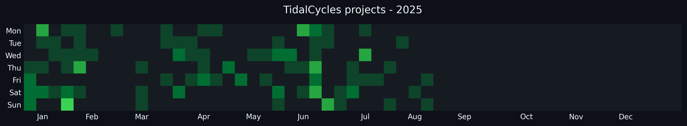
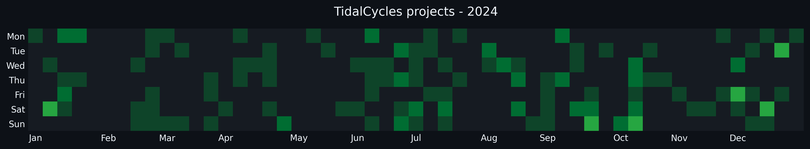
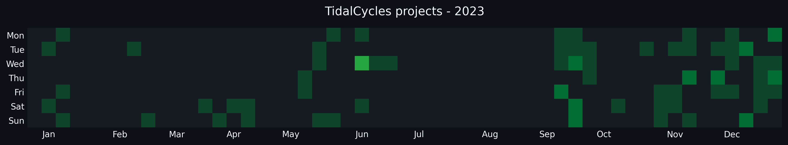
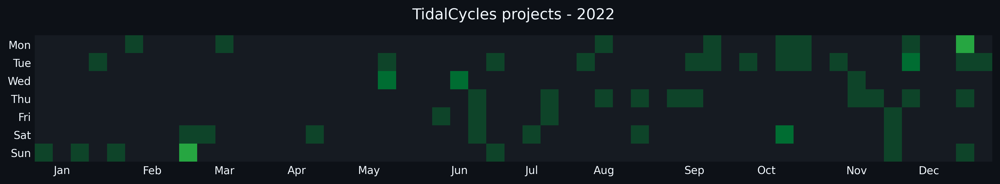
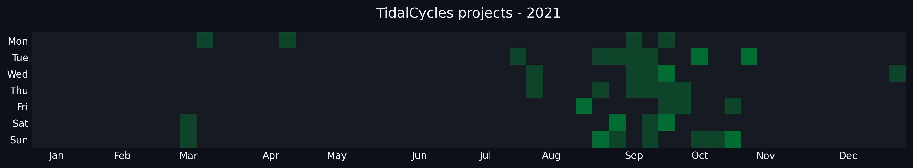

# TidalCycles code

Here is my TidalCycles (TC) code from live performances in 2021 and frequent nightly music production sessions.  

I use vim to write TC code and that code controls Ableton Live with MIDI. This code is more like sheet music I write and is not standalone music-production software.  

The file 'toolz.tidal' is the main collection of TC functions i've been writing.  The TC community, meetup series, and club.tidalcycles.org website have been crucially helpful.

If you have any questions about the code, send me an email at rtylermclaughlin@gmail.com and I will try to get back to you quickly.

## Activity

## A note on repetitiveness:

In programmming and software engineering, we're taught to not repeat ourselves. 
You'll find my TC code is actually quite repetitive. 
For creative applications, i find copying code can sometimes be empowering. 

The 'bugs' resulting from rapid coding are often more interesting than what I intended to create. And further, I don't have to worry about scaling and useability,  because at the end of the day, i'm trying to make art as quickly and expressively as possible.

This decision is also partly inspired by evolutionary biology. Scientists hypothesize that the genomes of complex organisms evolved largely through gene duplication and subsequent independent mutation.
By duplicating code and mutating it, I feel like I get unique and surprising results very rapidly.  Additionally, mimicking life is an important part of making art for me.
But mostly, it's the result of a conscious decision to spend more time making art and less time engineering.

I hope this made sense.

♡ 

tyler
